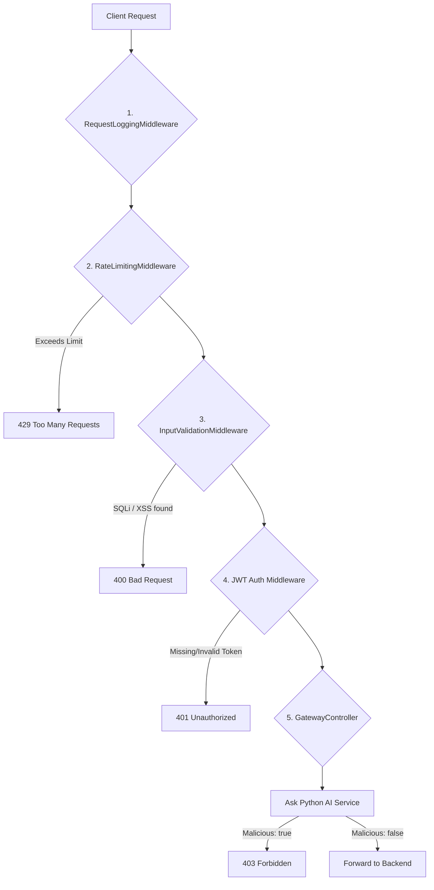

# Secure API Gateway — Completion Walkthrough

The Secure API Gateway has been successfully implemented and built targeting `.NET 10`. It features a full 5-stage middleware pipeline designed to protect your downstream services.

## What Was Completed

1. **Scaffolding**: Created a modern ASP.NET Core minimal API structure.
2. **Configuration**: Configured [appsettings.json](file:///c:/Users/asus/source/repos/SecureAPIGatway/SecureAPIGateway/appsettings.json) with JWT secrets, Rate Limit thresholds, and the AI Detection Service URL.
3. **Models**: Created [AiRequest](file:///c:/Users/asus/source/repos/SecureAPIGatway/SecureAPIGateway/Models/AiRequest.cs#6-16), [AiResponse](file:///c:/Users/asus/source/repos/SecureAPIGatway/SecureAPIGateway/Models/AiResponse.cs#6-12), and [LogEntry](file:///c:/Users/asus/source/repos/SecureAPIGatway/SecureAPIGateway/Models/LogEntry.cs#6-17) DTOs.
4. **Middleware Pipeline**:
   - [RequestLoggingMiddleware](file:///c:/Users/asus/source/repos/SecureAPIGatway/SecureAPIGateway/Middleware/RequestLoggingMiddleware.cs#13-17): Logs *every* request and status code via `Serilog`.
   - [RateLimitingMiddleware](file:///c:/Users/asus/source/repos/SecureAPIGatway/SecureAPIGateway/Middleware/RateLimitingMiddleware.cs#20-27): Enforces an IP rate limit using a thread-safe `ConcurrentDictionary` (100 reqs / 60 sec). 
   - [InputValidationMiddleware](file:///c:/Users/asus/source/repos/SecureAPIGatway/SecureAPIGateway/Middleware/InputValidationMiddleware.cs#27-31): Scans the URL query string and HTTP Request Body for SQL Injection/XSS patterns using Regex, preventing malicious payloads before they hit downstream services.
5. **Services**:
   - [AiDetectionService](file:///c:/Users/asus/source/repos/SecureAPIGatway/SecureAPIGateway/Services/AiDetectionService.cs#16-21): A robust `HttpClient` integration that sends request metadata to your Python AI engine. It is designed to "fail-open" so that if the Python service is offline, the API Gateway still functions but logs the failure.
6. **Controller**: [GatewayController](file:///c:/Users/asus/source/repos/SecureAPIGatway/SecureAPIGateway/Controllers/GatewayController.cs#8-77) which requires standard `[Authorize]` JWT Bearer tokens and handles the final forwarding logic.

## How the Pipeline Flows



## How to Test and Run it Locally

1. **Start the API Gateway**
   Run the following block in your terminal from the `SecureAPIGateway` directory:
   ```bash
   dotnet run
   ```
   The gateway will start on `http://localhost:5000` (or the port shown in your console).

2. **Generate a Test token**
   I've provided a simple python script that generates a valid JWT token signed with the correct secret key. Open a new terminal instance and run:
   ```bash
   python generate_token.py
   ```
   Copy the `eyJhbGci...` token it prints out.

3. **Test the Pipeline (Using curl)**

   **Test 1: Check JWT blocking (Should return 401 Unauthorized)**
   ```bash
   curl -i http://localhost:5000/api/gateway
   ```

   **Test 2: Check successful Auth (Should return 200 OK)**
   ```bash
   curl -i -H "Authorization: Bearer <YOUR_TOKEN_HERE>" http://localhost:5000/api/gateway
   ```

   **Test 3: Check SQL Injection blocking (Should return 400 Bad Request)**
   ```bash
   curl -i -H "Authorization: Bearer <YOUR_TOKEN_HERE>" http://localhost:5000/api/gateway?q=SELECT+*+FROM+Users
   ```

## Next Steps for the Team
- **Update JWT Secret**: Change the `SecretKey` in [appsettings.json](file:///c:/Users/asus/source/repos/SecureAPIGatway/SecureAPIGateway/appsettings.json) before deploying to staging/production.
- **Python Integration**: Have the team member building Layer 2 (Flask AI Engine) expose a `POST /api/analyze` endpoint running on `localhost:5001`. The Gateway is already configured to call it!
- **Forwarding**: I left a placeholder `Ok()` return in the [GatewayController](file:///c:/Users/asus/source/repos/SecureAPIGatway/SecureAPIGateway/Controllers/GatewayController.cs#8-77). Once your backend layer is ready, swap that `Ok()` return with an actual `HttpClient` call to forward the request downstream.
